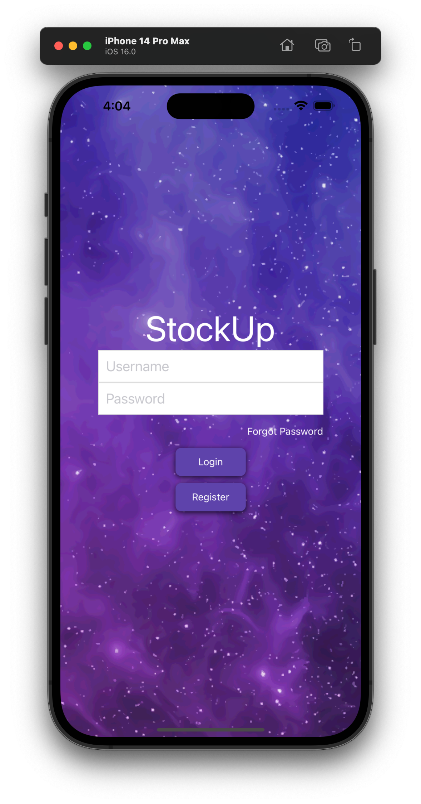
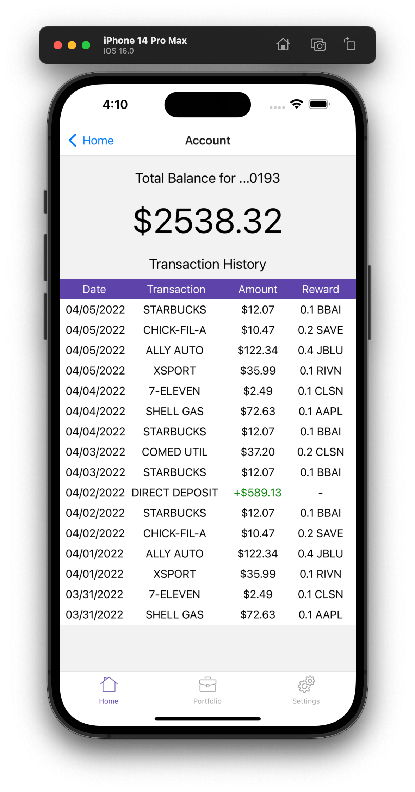

# StockUp
StockUp is a fully functional design and working UI implementation based on [Apollo](https://www.withapollo.com/), an early-stage startup from Y Combinator's Summer 2021 cohort. StockUp simulates the interface and experience interacting with a digital debit card that earns you shares of stock for purchases made. Created as the final project of CS 422 (User Interface Design and Programming, Spring 2022) at the University of Illinois at Chicago, this working UI implementation is the culmination of our team's research throughout the semester, utilizing methods learned in the course, to develop an interface that exemplifies a positive user experience. Developed using React Native.

## Table of contents
* [General Info](#general-info)
* [Getting Started](#getting-started)
* [Project Requirements](#project-requirements)
* [Technologies](#technologies)
* [Credits](#credits)
* [Live Demo](#live-demo)

## General info
This project is the final project for CS 422 (User Interface Design and Programming) at the University of Illinois at Chicago, Spring 2022. We were put into student groups of 3 or 4 members working as designers to design an interface for an emerging startup of our choice. We were required to follow the design process covered in the course to understand user needs, generate design ideas, refine our design ideas to generate an interactive high-fidelity prototype, build a working UI implementation of our prototype, and conduct user testing. The final day of the course included a public showcasing event which was attended by members of the UIC community.

## Getting Started
Before you begin, please make sure you have **Node.js**, **React**, and **Expo** installed, and ensure that you are running Node version >= 14.0.0 and npm version >= 5.6.0. Links to Node.js are provided below:
* Windows: https://nodejs.org/dist/v16.17.1/node-v16.17.1-x86.msi
* Mac: https://nodejs.org/dist/v16.17.1/node-v16.17.1.pkg
* Linux: https://nodejs.org/dist/v16.17.1/node-v16.17.1-linux-x64.tar.xz

Information about setting up the React Native and Expo environments are here:
* [React Native](https://reactnative.dev/docs/environment-setup)
* [Expo](https://docs.expo.dev/get-started/installation/)

You can check your version of Node and npm in your terminal using the following commands:

 
`node --version`

`npm --version`

Once Node is installed you can run the command
`npm install -g expo-cli`
within your terminal to install Expo. 

Once the development environment has been set up, download and navigate to the project folder within your terminal and run `npm start`. You can chose to view the application on a web browser (press "w"), using Android or iOS simulators (press "a" or "i"), or using your physical mobile device using the Expo Go app (scan the QR code in the terminal using Expo Go on Android or with the default Camera app on iOS). On launch, you should be welcomed by the login screen: 

<!---->

## Project Requirements

<!---->

    
    

The game is simple enough to play (but tricky to beat!) and instructions are provided in the help menu upon loading the game. They will also be referenced here: 
* **Controls:** W, A, S, D to move forward, view left, move backward, and view right accordingly. Space is to jump/power jump. Left click is to give out donuts.
* **Workers** may or may not have a "high temperature". There are 4 workers with a high temperature, and the rest do not. Your job is to seek out those 4 workers and give them each a donut. They are scattered throughout the office and some may be in hard to find locations.
* **Donuts** are given by left click, and may be restocked at the donut station close to the original spawn point. The player may only hold 3 donuts at one time, however, so a minimum of one restock is necessary to win.
* **Timing** is essential! You only have 3 minutes to seek out all the workers with a high temperature and give them each a donut. Good luck!
    
## Technologies
Project is created with:
* React version 17.0.1
* React Native version 0.07.2
* Node.js version 16.15.0
* npm version 8.3.1

## Credits
* **Login:** [Diana Villanueva](https://github.com/dvilla55), [Moody Samkary](https://github.com/MoodyAmroSamkary)
* **Register:** [Diana Villaneuva](https://github.com/dvilla55)
* **Home:** [Hannah Gavilan](https://github.com/hgavil)
* **Accounts:** [Hannah Gavilan](https://github.com/hgavil), [Abel Abraham](https://github.com/Abelaj50)
* **Portfolio:** [Abel Abraham](https://github.com/Abelaj50)
* **Stocks:** [Abel Abraham](https://github.com/Abelaj50)
* **Settings:** [Moody Samkary](https://github.com/MoodyAmroSamkary)

All credits to technologies used are given to their owners and all items specified in their respective licenses are adhered to throughout this project. Credits to:
* [mmazzarolo](https://github.com/mmazzarolo/react-native-dialog.git) for the react-native-dialog library.
* [Freepik](https://www.flaticon.com/free-icon/house-outline_25794?term=home&page=1&position=36&page=1&position=36&related_id=25794&origin=style) for the Home icon.
* [Dimitry Miroliubov](https://www.flaticon.com/free-icon/briefcase_639394?term=portfolio&page=1&position=1&page=1&position=1&related_id=639394&origin=style) for the Portfolio icon.
* [Gregor Cesnar Premium](https://www.flaticon.com/free-icon/settings_563541?term=settings&page=1&position=1&page=1&position=1&related_id=563541&origin=style) for the Settings icon.

Special thanks to Professor Nikita Soni and our TA Hasti Sharifi for bringing us together to work on this project and all their oversight and guidance! We had a lot of fun working together. 

## Live Demo
The following link leads to a visual demonstration of the project.
* https://www.evl.uic.edu/cs426/finals/2021-Spring/Videos/BrainTemp300.mp4

